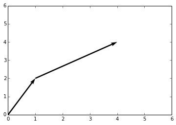
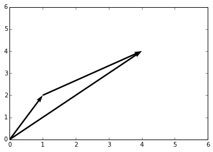
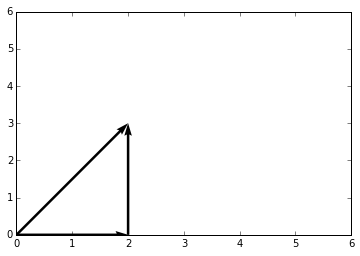
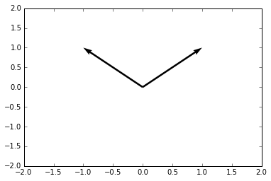

```python
from __future__ import print_function
```

#Linear Algebra in Python

##Working with vectors

###1: Vectors

Let's take a deeper look at matrices. Matrices are made up of rows and columns.

A matrix with a single column is called a column vector:

$\begin{bmatrix}
3\\ 
1\\ 
2
\end{bmatrix}$

A matrix with a single row is called a row vector:

$\begin{bmatrix}
3 & 1 & 2
\end{bmatrix}$

As you can see, a vector is a single row or a single column. We can add vectors together:

$\begin{bmatrix}
3\\ 
1\\ 
2
\end{bmatrix} + \begin{bmatrix}
1\\ 
2\\ 
3
\end{bmatrix} = 
\begin{bmatrix}
4\\ 
3\\ 
5
\end{bmatrix}$

When we add two vectors, we just add each of their elements in the same position together.

####Instructions

Add vector1 and vector2. Assign the result to vector1_2.

Add vector3 and vector1. Assign the result to vector3_1.


```python
import numpy as np

vector1 = np.asarray([4, 5, 7, 10])
vector2 = np.asarray([8, 6, 3, 2])
vector3 = np.asarray([10, 4, 6, -1])

vector1_2 = vector1 + vector2
print("vector1_2:", vector1_2)

vector3_1 = vector3 + vector2
print("vector3_1:", vector3_1)
```

    vector1_2: [12 11 10 12]
    vector3_1: [18 10  9  1]
    

###2: Vectors and scalars

We can also multiply vectors by single numbers, called scalars.

$4 * \begin{bmatrix}
1\\ 
2\\ 
3
\end{bmatrix} = 
\begin{bmatrix}
4\\ 
8\\ 
12
\end{bmatrix}$

In the example above, 4 is a scalar that we are multiplying the vector by. We multiply each element in the vector by the scalar.

####Instructions

Multiply vector by the scalar 7. Assign the result to vector_7.

Divide vector by the scalar 8. Assign the result to vector_8.


```python
vector = np.asarray([4, -1, 7])

vector_7 = vector * 7
print("vector_7:", vector_7)

vector_8 = vector / 8
print("vector_8:", vector_8)
```

    vector_7: [28 -7 49]
    vector_8: [ 0.5   -0.125  0.875]
    

###3: Plotting vectors

We make can the geometric interpretation of vectors more clear by plotting them. We can do this with the .quiver() method of matplotlib.pyplot. This enables us to plot vectors on a 2-d coordinate grid. We can then see what adding vectors together looks like.

In order to plot vectors, we would use:

    import matplotlib.pyplot as plt
    plt.quiver(X, Y, U, V, angles='xy', scale_units='xy', scale=1)

- X -- this is the origin of the vector (x coordinate)
- Y -- the y-coordinate origin of the vector
- U -- The distance the vector moves on the x axis.
- V -- the distance the vector moves on the y axis.

Each of X, Y, U, and V are single dimensional numpy arrays (vectors) or lists. The first item in each array corresponds to the first vector, the second item corresponds to the second vector, and so on. We can make the arrays as long or short as we want.

####Instructions

If you look at the plot, both vectors are stacked. The second vector starts right where the first vector ends. In fact, if you look at both vectors together, they end up getting us to the coordinates 4,4.

This is vector addition! By drawing one vector starting where the second one ended, we have effectively found the result of adding the two vectors.

Make a new plot that contains the two vectors in the first plot, but also adds a vector that starts at 0,0, and goes over 4 and up 4. This will end up at the coordinates 4,4. The final plot will have three vectors on it.

Set the x and y axis limits to [0,6].


```python
import numpy as np
import matplotlib.pyplot as plt
%matplotlib inline

# We're going to plot 2 vectors.
# The first will start at origin 0,0 , then go over 1 and up 2.
# The second will start at origin 1,2 then go over 2 and up 3.
X = [0,1]
Y = [0,2]
U = [1,3]
V = [2,2]

# Actually make the plot.
plt.quiver(X, Y, U, V, angles='xy', scale_units='xy', scale=1)

# Set the x axis limits.
plt.xlim([0,6])

# Set the y axis limits.
plt.ylim([0,6])

# Show the plot.
plt.show()

# Draw the second plot.
plt.quiver([0,1,0], [0,2,0], [1,3,4], [2,2,4], angles='xy', scale_units='xy', scale=1)
plt.xlim([0,6])
plt.ylim([0,6])
plt.show()
```








###4: Vector length

Now that we can plot vectors, we can intuitively figure out vector length. We just saw that a 2 dimensional vector can be represented as a line. Let's say we have this vector:

$X = \begin{bmatrix}
2 \\
3
\end{bmatrix}$

Since it's a line, we can calculate its length with the pythagorean theorem. If you think about it, this vector is just the sum of these two component vectors:

$X = \begin{bmatrix}
2 \\ 
3
\end{bmatrix} = \begin{bmatrix}
0\\
3
\end{bmatrix} + \begin{bmatrix}
2 \\
0
\end{bmatrix}$

Both component vectors only have length in one dimension. If we were creating the components of a three dimensional vector, there would be three components, and so on for even higher dimensional vectors.

We have a plot of this below for our [2,3] vector, and it's really just a triangle we're making. We can find the length of the hypotenuse of a triangle with the famous formula $a^{2} + b^{2} = c^{2}$, the Pythagorean theorem. We can rewrite this to find the length of c , the hypotenuse (long side). This gives us $c = \sqrt{a^{2} +  b^{2}}$. The length of any vector, no matter how many dimensions, is just the square root of the sum of all of its elements squared.

To find the length of a vector, we just apply the formula. In a two dimensional vector, the first element is the length of the bottom of the triangle (a), and the second element is the length of the right of the triangle (b). By taking the square root of $a^{2} + b^{2}$, we can find the length of the vector. We'll plot this out below and it will become more clear.

Below, we'll plot the two component vectors of the $\begin{bmatrix} 2 \\ 3 \end{bmatrix}$ vector we care about.

####Instructions

Compute the length of the vector $\begin{bmatrix} 2 \\ 3 \end{bmatrix}$. Assign the result to vector_length.


```python
# We're going to plot 3 vectors.
# The first will start at origin 0,0, then go over 2 (this represents the bottom of the triangle).
# The second will start at origin 0,2, and go up 3 (this is the right side of the triangle).
# The third will start at origin 0,0, and go over 2 and up 3 (this is our vector, and is the hypotenuse of the triangle).
X = [0,2,0]
Y = [0,0,0]
U = [2,0,2]
V = [0,3,3]

# Actually make the plot.
plt.quiver(X, Y, U, V, angles='xy', scale_units='xy', scale=1)
plt.xlim([0,6])
plt.ylim([0,6])
plt.show()

# We can compute the length of our vector [2,3].
vector_length = (4 + 9) ** .5
```





###5: Dot product

The dot product can tell us how much of one vector is pointing in the same direction as another vector. We find the dot product for vectors like this:

$\vec{a}\cdot\vec{b}=\begin{bmatrix}
a_{1} \\
a_{2} \\
a_{3}
\end{bmatrix} \cdot
\begin{bmatrix}
b_{1} \\
b_{2} \\
b_{3}
\end{bmatrix} = a_{1}b_{1} + a_{2}b_{2} + a_{3}b_{3}$

$\vec{a}$ and $\vec{b}$ are vectors. $a_{1}$ is the first element of the a vector, $a_{2}$ is the second, and so on. What this equation is saying is that we calculate the dot product by taking the first element of a, multiplying it by the first element of b, then adding that to the second element of a multiplied by the second element of b, then adding that to the third element of a multiplied by the third element of b.

This gives us a number that indicates how much of the length of a is pointing in the same direction as b. If you project a onto the vector b, then it indicates how much of a is "in" vector b. When two vectors are at 90 degree angles, the dot product will be zero.

Dot products can be applied to vectors with any number of dimensions -- we just multiply the elements at the same positions in both vectors and add the results.

Here's an example:

$\begin{bmatrix}
1 \\
1
\end{bmatrix} 
\cdot
\begin{bmatrix}
-1 \\
1
\end{bmatrix} = 1 * -1 + 1 * 1 = 0$
 
When two vectors are the same, the dot product will be the square of the vector length:

$\begin{bmatrix}
2 \\
3
\end{bmatrix} 
\cdot
\begin{bmatrix}
2 \\
3
\end{bmatrix} = 2 * 2 + 3 * 3 = 4 + 9 = 13$

It's not extremely important to understand the meaning of the dot product right now, but its calculation is important in many ways. Chief among them is determining if vectors are orthogonal. Two vectors are orthogonal if they are perpendicular (that is, at a 90 degree angle to each other), and their dot product is zero.

####Instructions

Assign the dot product of the vector $\begin{bmatrix} 3 \\ 4 \\ 5 \\ 6 \end{bmatrix}$, and the vector $\begin{bmatrix} 5 \\ 6 \\ 7 \\ 8 \end{bmatrix}$ to dot.


```python
# These two vectors are orthogonal.
X = [0,0]
Y = [0,0]
U = [1,-1]
V = [1,1]

plt.quiver(X, Y, U, V, angles='xy', scale_units='xy', scale=1)
plt.xlim([-2,2])
plt.ylim([-2,2])
plt.show()

dot = 3 * 5 + 4 * 7 + 5 * 8 + 6 * 9
```





###6: Making predictions

Now, let's try predicting how many points NBA players scored in 2013 using how many field goals they attempted. Our algorithm will be single variable linear regression. Remember that a single variable linear regression takes the form $y=mx+b.y$ is the variable we want to predict, $x$ is the value of the predictor variable, $m$ is the coefficient (slope), annd $b$ is an intercept term.

If you've done the statistics lessons, we worked out how to calculate the slope and intercept there. We won't rehash, but the slope is 1.26, and the intercept is -18.92.

Now, using the slope and intercept, we want to make predictions on the nba dataframe.

####Instructions

For each row in nba, predict the pts column using the fga column. Use the variables slope and intercept (already loaded in) to complete the linear regression equation. Your final output should be a pandas series -- assign the result to predictions.


```python
import pandas as pd

# Slope and intercept are defined, and nba is loaded in
nba = pd.read_csv('data/nba_2013.csv')
nba = nba[nba.FGA.str.contains("FGA") == False]
nba["FGA"] = nba["FGA"].astype(float)
slope = 1.2616130704
intercept = -18.9267271172

predictions = slope * nba["FGA"] + intercept
print("predictions:\n", predictions[:10])
```

    predictions:
     0      75.694253
    1     193.024269
    2    1122.833102
    3     -13.880275
    4      82.002319
    5      35.322635
    6      27.752956
    7    1643.879300
    8     553.845607
    9     802.383382
    Name: FGA, dtype: float64
    

###7: Multiplying a matrix by a vector

What we did when we were predicting our linear regression coefficients is fine for when we have one column we're using to predict, but remember that the linear regression equation has a coefficient for every single column that we're using to predict. So for three variables, it would be $y=m_{1}x_{1} + m_{2}x_{2} + m_{3}x_{3} + b$. Sometimes, we'll have thousands of columns we want to use to predict. Writing this out gets tedious (although we could use a for loop), but it's also very slow computationally, because we have to do thousands of separate calculations, and we can't optimize them.

Luckily, there's a faster and better way to solve linear regression equations, among other things. It's matrix multiplication, and it's a foundational block of a lot of machine learning.

For example, let's say that this matrix represents the coefficients of a linear regression (the first row is the x coefficient, the second row is the intercept term -- there is only one column, so this is a column vector):

$\begin{bmatrix}
3 \\
-1
\end{bmatrix}$

And this matrix represents the values of rows that we want to use to generate predictions. The first column is the x values, and the second column is there so that the intercept term can be added to the equation (this will make sense soon):

$\begin{bmatrix}
2 & 1 \\
5 & 1 \\
-1 & 1
\end{bmatrix}$

We can do matrix multiplication like this:

$\begin{bmatrix} 2 & 1 \\ 5 & 1 \\ -1 & 1 \end{bmatrix} * \begin{bmatrix}
3 \\
-1
\end{bmatrix} 
= \begin{bmatrix}
2 * 3 + 1 * -1 \\
5 * 3 + 1 * -1 \\
-1 * 3 + 1 * -1
\end{bmatrix} = \begin{bmatrix}
5 \\
14 \\
-4
\end{bmatrix}$

What we're doing is starting at the first row in our data. Then we multiply the first element of the first row by the first element in the coefficients. Then we multiply the second element in the first row by the second element in the coefficients column. We add these together. Then, we do the same for the second row in the data. We go across the rows in the first matrix we multiply, and go down the columns in the second matrix we multiply.

A more generic version:

$\begin{bmatrix} a_{11} & a_{12} \\ a_{21} & a_{22} \\ a_{31} & a_{32} \end{bmatrix} * \begin{bmatrix}
b_{11} \\
b_{21}
\end{bmatrix} 
= \begin{bmatrix}
a_{11} * b_{11} + a_{12} * b_{21} \\
a_{21} * b_{11} + a_{22} * b_{21} \\
a_{31} * b_{11} + a_{32} * b_{21}
\end{bmatrix}$

This is actually much faster and more efficient for a machine to compute than the method of addition that we did earlier. Adding the second column of 1s to the row enables us to add the intercept term when we multiply everything out.

We can perform matrix multiplication in python using the .dot() method of numpy.

####Instructions

Multiply nba_rows by nba_coefs. nba_rows contains two columns -- the first is the field goals attempted by each player in 2013, and the second is a constant 1 value that enables us to add in the intercept. Assign the result to predictions.


```python
import numpy as np

# Set up the coefficients as a column vector.
coefs = np.asarray([[3], [-1]])

# Setup the rows we're using to make predictions.
rows = np.asarray([[2,1], [5,1], [-1,1]])

# We can use np.dot to do matrix multiplication.  This multiplies rows by coefficients -- the order is important.
np.dot(rows, coefs)

nba_coefs = np.asarray([[slope], [intercept]])
nba_rows = np.vstack([nba["FGA"], np.ones(nba.shape[0])]).T
predictions = np.dot(nba_rows, nba_coefs)
```

###8: Applying matrix multiplication

Multiplying a matrix by a vector, like we did a few screens ago, is a special case of matrix multiplication. The more general case is multiplying two matrices by each other. We multiply a matrix by another matrix in many machine learning methods, including neural networks. Just like with linear regression, it enables us to do multiple calculations much more quickly than we could otherwise.

Let's say we wanted to multiply two matrices. First, the number of columns of the first matrix has to equal the number of rows of the second matrix. The final matrix will have as many rows as the first matrix, and as many columns as the second matrix. An easy way to think of this is in terms of matrix dimensions. We can multiply a 3x2 (rows x columns) matrix by a 2x3 matrix, and the final result will be 3x3.

Here's the generic version:

$\begin{bmatrix} 
a_{11} & a_{12} \\ 
a_{21} & a_{22} \\ 
a_{31} & a_{32} 
\end{bmatrix} * 
\begin{bmatrix}
b_{11} & b_{12}\\
b_{21} & b_{22}
\end{bmatrix} 
= \begin{bmatrix}
a_{11} * b_{11} + a_{12} * b_{21} & a_{11} * b_{12} + a_{12} * b_{22}\\
a_{21} * b_{11} + a_{22} * b_{21} & a_{21} * b_{12} + a_{22} * b_{22}\\
a_{31} * b_{11} + a_{32} * b_{21} & a_{31} * b_{12} + a_{32} * b_{22}
\end{bmatrix}$

And here's an example:

$\begin{bmatrix} 
2 & 1 \\ 
5 & 1 \\ 
-1 & 1 
\end{bmatrix} * 
\begin{bmatrix}
3 & 1 \\
-1 & 2
\end{bmatrix} 
= \begin{bmatrix}
2 * 3 + 1 * -1 & 2 * 1 + 1 * 2\\
5 * 3 + 1 * -1 & 5 * 1 + 1 * 2\\
-1 * 3 + 1 * -1 & -1 * 1 + 1 * 2
\end{bmatrix} = \begin{bmatrix}
5 & 4 \\
14 & 7 \\
-4 & 1
\end{bmatrix}$
 
We can multiply matrices with the numpy .dot method. It's important to understand how matrix multiplication works, but you'll almost never have to do it by hand.

####Instructions

Multiply A and B together. Assign the result to C.


```python
A = np.asarray([[5,2], [3,5], [6,5]])
B = np.asarray([[3,1], [4,2]])

C = np.dot(A, B)
print("C:\n", C)
```

    C:
     [[23  9]
     [29 13]
     [38 16]]
    
